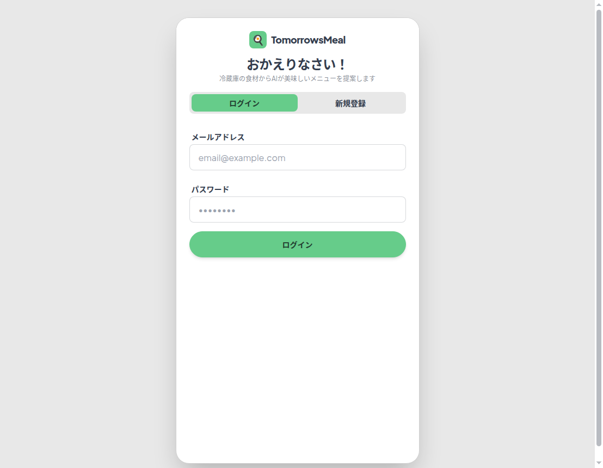
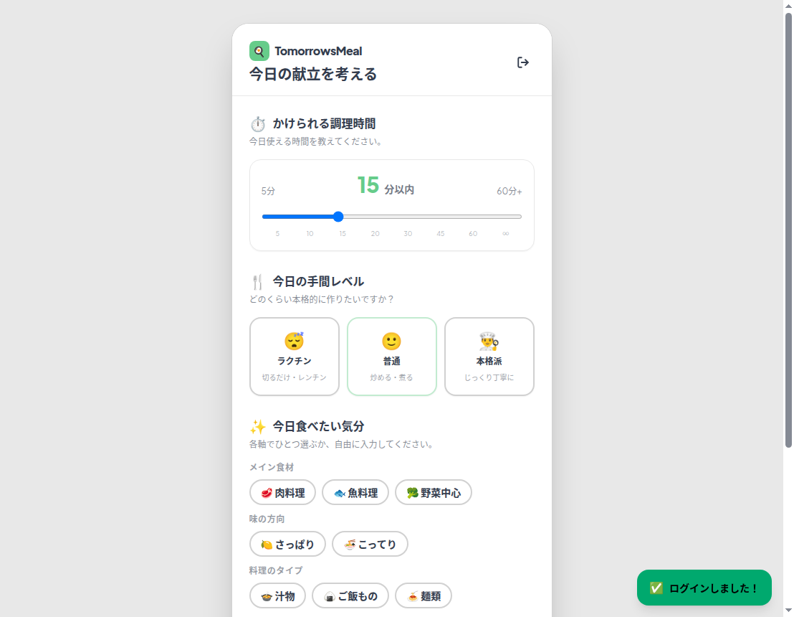
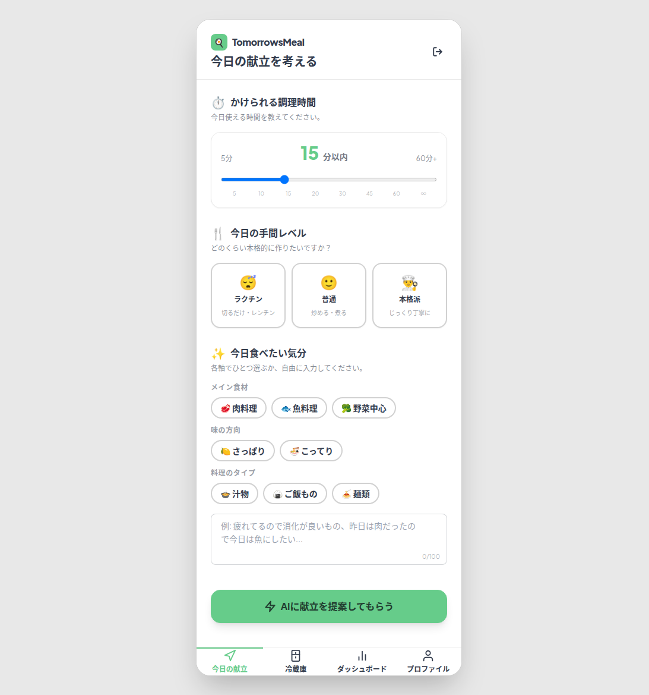
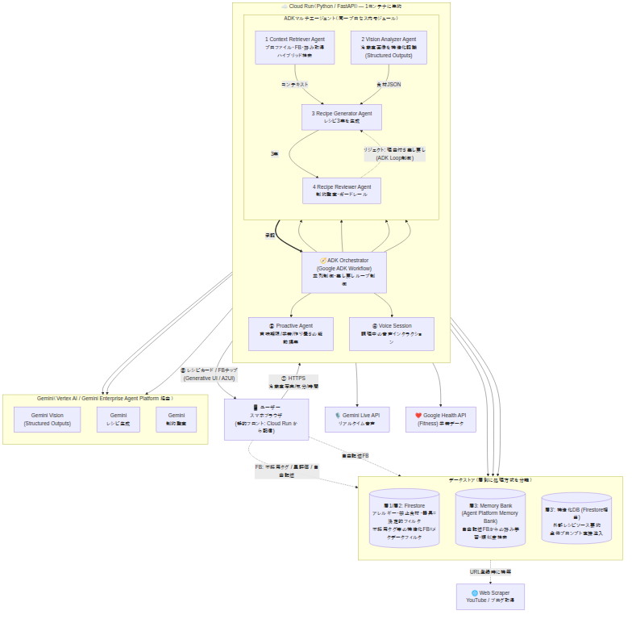
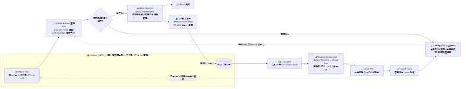

<div align="center">

# 🥗 TomorrowsMeal（トゥモローズミール）

### 冷蔵庫の残り物を撮るだけ。AIエージェントが「今日の献立」を考えてくれる。

**DevOps × AI Agent Hackathon（Google Cloud 主催）応募作品**

[](https://cloud.google.com/)
[](https://www.python.org/)
[](https://fastapi.tiangolo.com/)
[](https://www.terraform.io/)
[](LICENSE)

**🔗 [デプロイ済みアプリを開く](https://tomorrows-meal-webapp-td7ugk7iva-an.a.run.app)**

<!-- TODO: デモ動画URL -->

</div>

---

## 📖 目次

- [1. これは何か](#1-これは何か)
- [2. 解きたい課題](#2-解きたい課題)
- [3. デモ](#3-デモ)
- [4. アーキテクチャ ―「AIエージェントである必然性」](#4-アーキテクチャ-aiエージェントである必然性)
- [5. DevOps × AI Agent の核 ―「2つのループ」](#5-devops--ai-agent-の核--2つのループ)
- [6. 3層データ設計 ―「意図的な分離」](#6-3層データ設計--意図的な分離)
- [7. 技術スタック](#7-技術スタック)
- [8. ローカルセットアップ・実行手順](#8-ローカルセットアップ実行手順)
- [9. デプロイ](#9-デプロイ)
- [10. ライセンス](#10-ライセンス)

---

## 1. これは何か

**TomorrowsMeal** は、冷蔵庫の中身を撮影するだけで、**AIエージェントの協調によって「今日の献立（朝・昼・晩の3食）」を提案する**モバイルWebアプリです。

- 📷 **冷蔵庫を撮る** → Gemini Vision が食材・量・鮮度を構造化認識
- 🤖 **4つのAIエージェントが協調** → プロファイル取得 → 生成 → 監査 → 差し戻しループで安全な献立を組み立て
- 👍 **フィードバックで育つ** → 「不採用」タップや調理後の5段階評価から、あなた専用の嗜好を学習
- 🔁 **AI自体が継続改善される** → 提案品質を LLM-as-judge で自動評価し、改善PRを自動起票して人がレビュー

「作って終わり」の生成AIではなく、**嗜好が変わり続けても育ち続ける "保守できるAI"** を目指しました。

---

## 2. 解きたい課題

共働き・単身・高齢者世帯に共通する、毎日の「食」にまつわる目に見えない負担を解消します。

| 課題 | 誰の痛みか | TomorrowsMeal のアプローチ |
| --- | --- | --- |
| **献立検討の認知負荷（名もなき家事）** | 共働き世帯 |「今日何作ろう」をAIに委譲。冷蔵庫写真と気分だけで3食が決まる |
| **食品ロス** | すべての家庭 | 手持ちの食材と賞味期限から優先的に使い切るレシピを提案 |
| **栄養管理の民主化** | 高齢者・単身者 | 専門知識なしで栄養バランスが整う。前日の栄養から自律的に調整 |

測定するのは Output（提案数）ではなく **Outcome / Impact** です。食材使い切り率・栄養目標達成率・献立決定時間の短縮を、アプリ内ダッシュボードに実測値で可視化します。

---

## 3. デモ

**🔗 本番環境:** https://tomorrows-meal-webapp-td7ugk7iva-an.a.run.app

**🎬 デモ動画:** <!-- TODO: デモ動画URL -->

| ① ログイン | ② メイン画面 | ③ 提案結果 |
| :---: | :---: | :---: |
|  |  |  |

> Google アカウントでログイン後、冷蔵庫の写真・調理時間・気分を入力すると、AIエージェント群が3食分の献立カードを生成します。各カードから即座にフィードバック（不採用・調理後評価）が可能です。

---

## 4. アーキテクチャ ―「AIエージェントである必然性」

**図A：ランタイム（ループA / 4エージェント協調）**



**図B：DevOps（ループB / 自己改善パイプライン）**



<!-- 図のソース（Mermaid）と技術補足は docs/architecture.md / docs/architecture-notes.md を参照。以下は SPEC.md §5.1 のランタイム構成図の要約です。 -->

単一の巨大プロンプトではなく、**役割ごとに特化した4つのエージェントを Google ADK で協調**させています。核心は「**生成 → 監査 → 差し戻し**」のループです。生成AIは確率的に外すため、**アレルギー・禁止食材・未所持の調理器具といった安全制約を、独立した Reviewer エージェントが決定的に監査し、違反時は理由を添えて Generator に差し戻して再生成させます**。この監査ループこそが「エージェントである必然性」であり、単なるAPI呼び出しでは実現できない自律的な振る舞いです。

```text
[フロントエンド] スマホWebアプリ（HTML/CSS/JS・A2UIストリーミング対応）
       │ ▲
       │ │ (HTTPS / インタラクティブなレシピカード・FB用スマートチップ)
       ▼ │
[バックエンド] Cloud Run (Python / FastAPI)  ※4エージェントは1プロセス内に同居
       │
       ├─► [ADK Orchestrator: 並列・監査ループ制御]
       │       │
       │       ├─► 1. Context Retriever Agent（プロファイル・FB・好み取得）
       │       │        ├──► [層1/層2] Firestore（アレルギー・禁止食材=決定的フィルタ / 除外タグ）
       │       │        ├──► [層3]     Agent Platform Memory Bank（好みの長期記憶）
       │       │        └──► [層3']    Firestore（お気に入り外部レシピソース → 全件プロンプト注入）
       │       │
       │       ├─► 2. Vision Analyzer Agent（食材解析 / Gemini Structured Outputs）
       │       │
       │       ├─► 3. Recipe Generator Agent（3食レシピ生成）
       │       │
       │       └─► 4. Recipe Reviewer Agent（制約監査 / ガードレール）
       │                └──► 違反時は Generator に差し戻し（ADK Loop）
       │
       └─► [外部API]
               ├─► Gemini Live API（調理中の音声インタラクション / WebSocket）
               ├─► Google Health API（栄養バランス連携）
               └─► Web Scraper（YouTube / ブログ → 層3' へ構造化保存）
```

**4エージェントの役割**（実装: [`app/agents/`](app/agents/)）

| エージェント | ファイル | 役割 |
| --- | --- | --- |
| **Orchestrator** | `orchestrator.py` | ADK Workflow で並列実行・監査ループ・差し戻しを制御 |
| **Context Retriever** | `context_retriever.py` | 層1/2/3 からプロファイル・除外タグ・好みをハイブリッド収集 |
| **Vision Analyzer** | `vision_analyzer.py` | 冷蔵庫画像を Gemini で構造化認識（食材・量・鮮度のJSON） |
| **Recipe Generator** | `recipe_generator.py` | 収集情報＋気分・調理時間を統合し3食のレシピ案を生成 |
| **Recipe Reviewer** | `reviewer.py` | アレルギー・除外タグ・未所持器具を監査し違反を差し戻し |

> 追加エージェント: 音声調理アシスタント（`voice_session.py` / Gemini Live）、能動提案（`proactive.py`）、外部レシピソース抽出（`source_extractor.py`）も実装済み。

---

## 5. DevOps × AI Agent の核 ―「2つのループ」

本作品がハッカソンテーマ **「DevOps × AI Agent」** に直結する差別化点は、**製品としての学習ループ（ループA）** と、**開発フローとしての継続改善ループ（ループB）** を明確に分離・連携させたことです。ループAだけでは "AIの学習" に過ぎません。**ループBがあって初めて "AIエージェントの DevOps"** が成立します。

### 🔁 ループA ― 製品のML学習フライホイール（燃料）

ユーザーのフィードバックを実行時に取り込み、次回提案の精度を上げる製品機能です。

- **提案時（ネガティブFB）:** 「不採用」タップで料理名ではなく**特徴タグ**（`#揚げ物` `#豚肉` 等）を抽出し、除外フィルタとして蓄積
- **調理後（ポジティブ/詳細FB）:** 星5段階＋スマートチップで構造化データを低摩擦で回収、自由記述は Memory Bank へ

### ⚙️ ループB ― DevOps: エージェント自体を継続改善する（駆動輪）

集約されたフィードバックをもとに、**エージェントのプロンプト/ロジックそのもの**を継続改善するライフサイクルを GitHub Actions で自動化しています。

```text
① バージョン管理   プロンプト/嗜好抽出ロジックを Git 管理（diff/PR で可視化）
        ↓
② 定期eval         GitHub Actions が毎日 LLM-as-judge で提案品質を回帰評価（eval.yml）
        ↓
③ 自動起票         スコア低下時、修正案入りの改善PRを自動起票＋Slack通知（auto_improve.yml）
        ↓
④ レビュー & デプロイ 人がレビュー（Human-in-the-loop）→ main マージ → Cloud Run 自動デプロイ（deploy.yml）
        ↓
⑤ 可観測性         Cloud Trace で各フェーズを計装し、品質スコア推移をダッシュボード可視化
```

| フロー | 実装 |
| --- | --- |
| 定期eval（毎日 JST 09:00 / PR時） | [`.github/workflows/eval.yml`](.github/workflows/eval.yml) + [`scripts/eval.py`](scripts/eval.py) |
| 改善PR自動起票（eval失敗で自動トリガー）| [`.github/workflows/auto_improve.yml`](.github/workflows/auto_improve.yml) + [`scripts/auto_improve.py`](scripts/auto_improve.py) |
| Cloud Run 自動デプロイ（mainマージ） | [`.github/workflows/deploy.yml`](.github/workflows/deploy.yml) |
| 可観測性 | OpenTelemetry → Cloud Trace（[`app/main.py`](app/main.py)） |

> **設計上のガードレール:** 改善PRは**自動マージしません**。Draft PR として起票し、必ず人がレビューします（Human-in-the-loop）。

---

## 6. 3層データ設計 ―「意図的な分離」

「すべてを無差別にベクトル化して検索ノイズを増やす」ことを避け、**データ特性ごとに処理方式を分けた**のが本システムの設計思想の中核です。

| 層 | 内容 | 処理方式 | なぜこの方式か |
| --- | --- | --- | --- |
| **層1：安全・ハード制約** | アレルギー / 禁止食材 / 調理器具 | **決定的フィルタ（if文による機械的除外）**。ベクトル検索は使わない | 確率的挙動によるアレルギー食材の見落とし事故を防ぐ絶対的ガードレール |
| **層2：嗜好プロファイル** | FBから学習したルール・除外タグ | **構造化テキスト + Git管理** | 人間が読める・監査できる透明性。diff/PRレビューと定期evalによる回帰評価を可能に |
| **層3：好み学習** | 自由記述FB・会話ログ | **Agent Platform Memory Bank**（フルマネージド長期記憶） | ユーザーごとにスコープ分離された記憶を自動生成・自己整理。DBの自前運用を排除 |

> **確率的な記憶（層3）と決定的な安全ガードレール（層1）の意図的な分離**そのものが、本作品の設計上の主張です。アレルギー・禁止食材には Memory Bank（確率的記憶）を**絶対に使わず**、if文による決定的フィルタを厳守しています。

---

## 7. 技術スタック

### ✅ ハッカソン必須要件との対応

| 審査要件 | 採用プロダクト | 本作品での用途 |
| --- | --- | --- |
| **(必須) Google Cloud アプリ実行プロダクト** | **Cloud Run** | バックエンド + 4エージェント + 静的フロントを1サービスに集約してホスト |
| **(必須) Google Cloud AI 技術** | **Gemini API**（Gemini Enterprise Agent Platform ＝ 旧 Vertex AI 経由） | 冷蔵庫画像のマルチモーダル認識・レシピ生成・監査・LLM-as-judge |
| 〃 | **ADK（Agents Development Kit）** | 4エージェントの並列実行・監査ループ・差し戻し制御 |

### 🧩 Google Cloud プロダクト（全体）

- **Cloud Run** ― サーバーレス実行環境（本番ホスティング）
- **Gemini API / Gemini Enterprise Agent Platform（旧 Vertex AI）** ― 生成・Vision（Structured Outputs）・Live API
- **ADK** ― マルチエージェント・オーケストレーション
- **Firestore**（Native） ― 層1/層2/層3' の構造化データストア
- **Agent Platform Memory Bank** ― 層3 の好み学習（フルマネージド長期記憶）
- **Cloud Trace**（OpenTelemetry） ― 各フェーズの可観測性
- **Artifact Registry / Workload Identity Federation / Secret Manager** ― CI/CD 基盤

### 🛠️ その他

- **バックエンド:** Python 3.11 / FastAPI / Uvicorn / slowapi（レートリミット）
- **フロントエンド:** HTML / CSS / JavaScript（モバイルファースト）、Tailwind CSS + daisyUI のデザイン方針
- **IaC:** Terraform（`infra/terraform/`）
- **CI/CD:** GitHub Actions（unit test / docker build / eval / 自動起票 / デプロイ / terraform plan・apply）
- **テスト:** pytest（unit / integration）、Playwright（E2E）、`uv` によるパッケージ管理

---

## 8. ローカルセットアップ・実行手順

> パッケージ管理は [`uv`](https://docs.astral.sh/uv/) を使用します。

### 方法1: Docker Compose（推奨）

```bash
docker compose up --build
```

- メイン画面: http://localhost:8000/
- ヘルスチェック: http://localhost:8000/health

`app/` を編集するとホットリロードされます。停止は `docker compose down`。

### 方法2: ローカル Python 環境（uv）

```bash
# 依存関係の同期（dev含む）
uv sync --dev

# 起動
uv run uvicorn app.main:app --reload --port 8000
```

### テスト・Lint

```bash
# 単体テスト（CI相当）
uv run pytest tests/unit/ -v

# E2E（アプリ起動後）
docker compose up -d
uv run pytest tests/e2e/ -v

# Lint / フォーマット
uv run ruff check --fix .
uv run ruff format .
```

詳細は [CONTRIBUTING.md](CONTRIBUTING.md) を参照してください。

---

## 9. デプロイ

`main` ブランチへのマージ（PRレビュー・承認後）をトリガーに、[`deploy.yml`](.github/workflows/deploy.yml) が Docker イメージをビルドして Artifact Registry へ push し、Cloud Run を更新します。デプロイ後は `/health` を最大5回ポーリングし、失敗時は Slack に通知します。

GCP リソース（Cloud Run / Artifact Registry / Firestore / Workload Identity Federation / IAM）はすべて `infra/terraform/` で宣言的に管理されており、初回セットアップは `terraform apply` で完結します。

```bash
cd infra/terraform
cp terraform.tfvars.example terraform.tfvars   # project_id 等を設定
terraform init && terraform plan && terraform apply
```

手順の詳細は [docs/deploy.md](docs/deploy.md) を参照してください。

---

## 10. ライセンス

本プロジェクトは [MIT License](LICENSE) の下で公開されています。

---

<div align="center">

### 📚 関連ドキュメント

[設計仕様 SPEC.md](SPEC.md) ・ [コンセプト & ピッチ PITCH.md](PITCH.md) ・ [開発ガイド CONTRIBUTING.md](CONTRIBUTING.md) ・ [デプロイ docs/deploy.md](docs/deploy.md)

**TomorrowsMeal** ― 冷蔵庫の残り物から、明日の食卓を。

</div>
