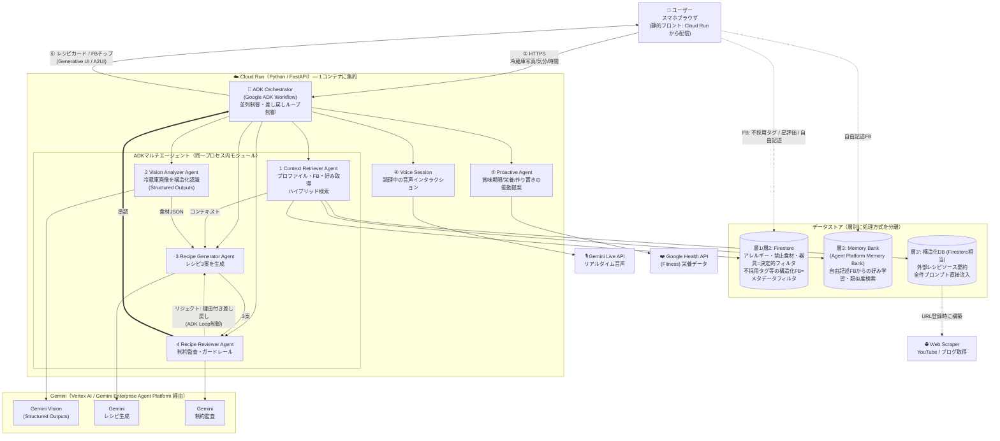
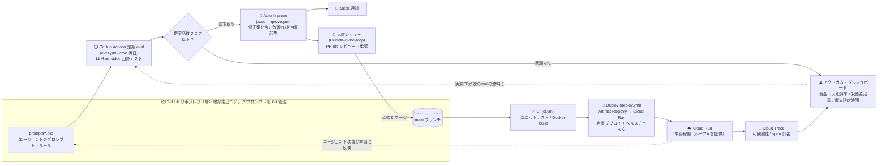

# TomorrowsMeal アーキテクチャ図

> ハッカソン提出（Proto Pedia「システム構成図」）用の清書図。
> 設計の根拠は [SPEC.md](../SPEC.md)（§4「2つのループ」/ §5 アーキテクチャ / §6 デプロイ構成 / §7 全体俯瞰）を参照。
> このドキュメントの Mermaid ソースを PNG 化して Proto Pedia にアップロードする（手順は [architecture-notes.md](architecture-notes.md)）。

TomorrowsMeal は「AIエージェントが価値の中心」であることを 2 つのループで表現する。
**図A（ループA / ランタイム）** はユーザー体験を駆動する ADK マルチエージェントの協調、
**図B（ループB / DevOps）** はエージェント自身を継続改善する自己改善パイプラインを示す。

---

## 図A：ランタイム・アーキテクチャ（ループA / ML学習フライホイール）

ユーザーがスマホから「冷蔵庫写真・気分・調理時間」を送ると、Cloud Run 内の **ADK Orchestrator** が
4 エージェント（Context Retriever / Vision Analyzer / Recipe Generator / Recipe Reviewer）を協調させ、
**「生成 → 監査 → 差し戻しループ」** を経て安全な献立 3 案を返す。
層1/層2（Firestore・決定的フィルタ）、層3（Memory Bank）、層3'（構造化DB）、Gemini（Vertex AI 経由）、
Gemini Live API、Health API への接続を明示している。

---

## 図B：DevOps 自己改善パイプライン（ループB）

エージェント自身のプロンプト/ロジックを Git で管理し、**GitHub Actions の定期 eval（LLM-as-judge 回帰テスト）**で
提案品質を監視する。品質スコアが低下すると**改善 PR を自動起票（＋Slack 通知）**、
**人間のレビュー（Human-in-the-loop）**を経て main へマージすると Cloud Run へ自動デプロイされ、
**Cloud Trace** による可観測性とアウトカム・ダッシュボードへループが還る。

---

## 2つのループの関係（俯瞰）

- **ループA（燃料 / 製品のML学習）**: 図A。ユーザーFBで層2/層3を動的更新し、次回提案精度を上げる実行時機能。
- **ループB（駆動輪 / DevOps）**: 図B。蓄積FBをもとに開発者がエージェント自体を継続改善するライフサイクル。
- ループAだけでは DevOps ではない。**ループBがあって初めて「DevOps × AI Agent」**が成立する（SPEC §4）。
